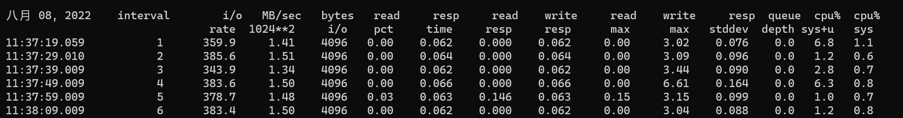
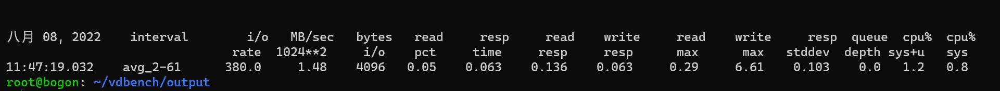
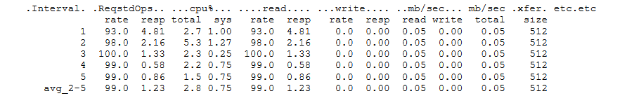
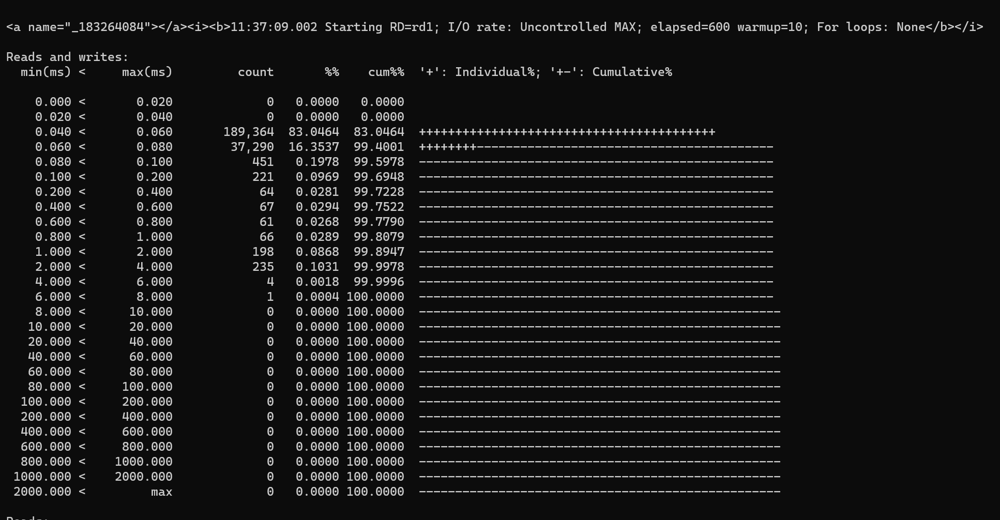

### Vdbench OutPut

| 文件名               | 文件说明                                                     |
| -------------------- | ------------------------------------------------------------ |
| summary.html         | 包含每个运行和间隔的工作负载结果。summary.html 还包含到所有其他html文件的链接，当使用浏览器查看时，应该将其作为一个起点。 |
| total.html           | 运行报告的总体概括                                           |
| hostx.summary.html   | 与summary.html文档性质相同，主要是多主机环境中使用，当不在多主机环境中使用时，此报告将与summary.html相同。 |
| hostx-n.summary.html | 一个特定salve的概要                                          |
| logfile.html         | 包含控制台窗口上显示的大多数消息的副本，包括调试所需的多条消息。 |
| hostx_n.stdout.html  | 包含一个特定salve的日志文件类型信息。                        |
| parmfile.html        | ' -f parmfile '执行参数中参数文件的副本。                    |
| parmscan.html        | 包含当前正在解析的参数数据的运行轨迹。如果给出解析或参数错误，此文件将向您显示正在解析的最新参数。 |
| sdname.html          | 包含每个定义的存储定义的性能数据。                           |
| hostx.sdname.html    | 与sdname.html性质相同，多主机环境下使用。                    |
| hostx_n.sdname.html  | SD报告为一个特定的slave，该报告仅在使用' report=slave_detail '参数时创建。 |
| kstat.html           | 包含针对Solaris的Kstat汇总性能数据。                         |
| hostx.kstat.html     | 与kstat.html性质相同，多主机环境下使用。                     |
| host_x.instance.html | 包含每个Kstat '实例'的Kstat设备详细性能数据。                |
| nfs3/4.html          | 仅针对Solaris:每个间隔的详细NFS统计信息类似于nfsstat命令的输出。 |
| flatfile.html        | 包含详细统计信息的文件，用于提取和输入其他报告工具。         |
| errorlog.html        | 任何 I/O 错误或数据验证错误都将在此处写入。此文件用作 “./vdbench dvpost” 后处理实用程序的输入。 |
| swat_mon.txt         | 可以将该文件导入Swat性能监视器，从而显示Vdbench运行的性能图表。 |
| swat_mon_total.txt   | 与swat_mon.txt类似，但允许 Swat 仅显示运行总计。             |
| swat_mon.bin         | 与上面的swat_mon.txt类似，但适用于文件系统工作负载数据。     |
| messages.html        | 仅适用于 Solaris 和 Linux。在运行结束时，/var/adm/messages 或 /var/log/messages 的最后 500 行将复制到此处。当显示某些 I/O 错误或超时消息时，这些消息可能很有用。 |
| fwdx.html            | 每个文件系统工作负载定义(FWD)的详细报告。                    |
| wdx.html             | 当指定了多个工作负载时，将为每个工作负载定义(WD)生成一个单独的工作负载报告。 |
| histogram.html       | 仅适用于文件系统工作负载。响应时间直方图报告所有请求的 FWD 操作的响应时间详细信息。 |
| sdx.histogram.html   | 每个 SD 的响应时间直方图。                                   |
| wdx.histogram        | 每个 WD 的响应时间直方图。仅当有多个 WD 时才生成。           |
| fsdx.histogram.html  | 每个 FSD 的响应时间直方图。                                  |
| fwdx.histogram       | 每个 FWD 的响应时间直方图。仅当有多个 FWD 时生成。           |

##### 文件说明

1. summary.html

   'summary.html'报告每个报告间隔中为每次运行生成的总工作负载，以及除第一次以外的所有间隔的加权平均值。注意:对于运行总数，第一个间隔将被忽略，除非在这种情况下使用了warmup=参数，你可以要求Vdbench忽略多个间隔。

   

   | 参数名       | 说明                                                         |
   | ------------ | ------------------------------------------------------------ |
   | interval     | 报告间隔序数                                                 |
   | I/O rate     | 平均每秒观察到的I/O速率。                                    |
   | MB sec       | 传输数据的平均兆字节数。                                     |
   | bytes I/O    | 平均数据传输大小。                                           |
   | read pct     | 读取的平均百分比。                                           |
   | resp time    | 平均响应时间测量为读/写请求的持续时间。所有I/O时间都以毫秒为单位。 |
   | read resp    | 读取的平均响应时间                                           |
   | write resp   | 写入的平均响应时间                                           |
   | resp max     | 在此间隔内观察到的最大响应时间。最后一行包含总max。          |
   | resp stddev  | 响应时间的标准偏差。                                         |
   | queue depth  | 平均 I/O 队列深度由 Vdbench 计算。与 Kstat 结果可能略有不同，这是由于在 I/O 过程中的什么时间进行计算。还要意识到Kstat报告两个队列：主机等待队列和设备活动队列。 |
   | cpu% sys+usr | Processor busy = 100 - (system + user time) (Solaris, Windows, Linux) |
   | cpu% sys     | 处理器利用率;系统时间。注意，如果测试期间的平均cpu利用率达到80%，Vdbench将显示一个警告。这将警告您可能没有足够的cpu周期来在尽可能高的工作负载下正常运行。 |

   

2. total.html

   运行总计报告允许您快速查看所有总计，而不需要一页又一页地滚动查看详细的间隔结果。

   

3. summary.html 对与文件系统测试

   

   | 参数名     | 说明                                                         |
   | ---------- | ------------------------------------------------------------ |
   | Interval:  | 报告间隔序数                                                 |
   | ReqstdOps  | 请求操作的总数。虽然请求operation=read需要一个open操作，但这个open没有被特别请求，因此不包括在这个计数中。然而，IS在“开放”栏目报道了这一开放。对于格式运行，此计数包括所有写操作。 |
   | cpu% total | Processor busy = 100 - (system + user time) (Solaris, windows, Linux) |
   | cpu% sys   | 处理器利用率;系统时间                                        |
   | read       | 总读取时间和平均响应时间                                     |
   | write      | 总写入时间和平均响应时间                                     |
   | mb/sec     | 读、写和（读和写的总和）每秒Mb。                             |
   | xfer       | 读写操作的平均传输大小。                                     |
   | .....      | 两列分别用于所有剩余操作。                                   |

4. logfile.html

   'logfile.html'包含Java代码写入终端的每一行信息的副本。logfile.html主要用于调试目的。

5. history.html

   该报告显示了读和写、读和写的响应时间分布。当只完成读或写操作时，当然只有一个报告。为每个SD和FSD生成直方图，如果指定了多个，则为每个WD和FWD生成直方图。请注意，这个文件可以作为一个以制表符分隔的文件直接读入Excel。

   

   

6. flatfile.html

   “flatfile.html”以逐列 ASCII 格式包含 Vdbench 生成的信息。文件的第一行包含一个单词“列标题名称”；文件的其余部分包含属于每一列的数据。这种文件格式的目的是允许将信息轻松传输到电子表格，从而创建性能图表。flatfile.html 数据既用于原始的RAW I/O Vdbench功能(SD/WD/RD)，也用于使用FSD/FWD/RD参数进行文件系统测试。